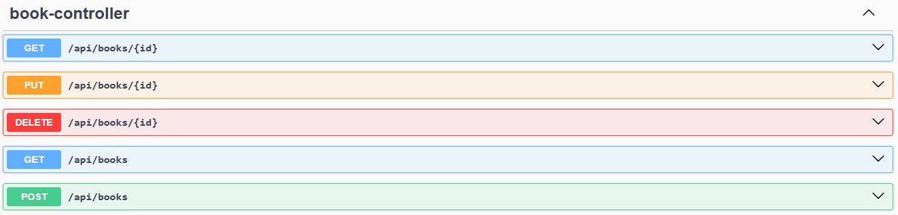
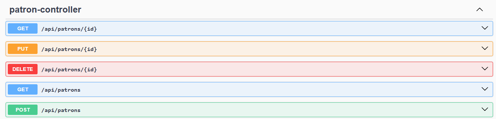
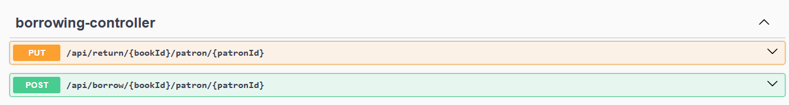

# Library-Management-System
The Library Management System API is built using Spring Boot 3.4.3 and provides RESTful endpoints to manage books, patrons, and borrowing records. It uses H2 as the database and supports Basic Authentication for secured access.

## Running the Application

1. Clone the repository
  `git clone [repository-url](https://github.com/soliman-sDev/Library-Management-System)`
  `cd library-management-system`

2. Build and run the application
  `mvn spring-boot:run`

3. Access H2 Database Console
> URL: http://localhost:8080/h2-console
> JDBC URL: jdbc:h2:mem:librarydb
> Username: sa,
> Password: (leave empty)

## Authentication (Basic Auth)
This API uses Basic Authentication to secure endpoints. You must provide a username and password in the request header.
username and password can edit from application.properties file
`spring.security.user.name=admin`
`spring.security.user.password=admin123`

## API Endpoints
**Books Management**
| Method      | Endpoint | Description     |
| :---        |    :----:   |          ---: |
| GET      | api/books       | Retrive all books   |
| GET   | api/books/{id}        | Retrive book by Id      |
| POST      | api/books       | Add new book   |
| PUT   | api/books/{id}        | Update a book      |
| DELETE   | api/books/{id}        | Delete a book      |

**Patrons Management**
| Method      | Endpoint | Description     |
| :---        |    :----:   |          ---: |
| GET      | api/patrons       | Retrive all patrons   |
| GET   | api/patrons/{id}        | Retrive patron by Id      |
| POST      | api/patrons       | Add new patron   |
| PUT   | api/patrons/{id}        | Update a patron      |
| DELETE   | api/patrons/{id}        | Delete a patron      |

**Borrowing Record**
| Method      | Endpoint | Description     |
| :---        |    :----:   |          ---: |
| POST      | api/borrow/{bookid}/patron/{patronid}       | Allow a patron to borrow a book   |
| PUT   |  api/return/{bookid}/patron/{patronid}       | Record the return of a borrowed book      |

open the [API Endpoint doc](http://localhost:8080/swagger-ui/index.html) after running the application to see the endpoint details
